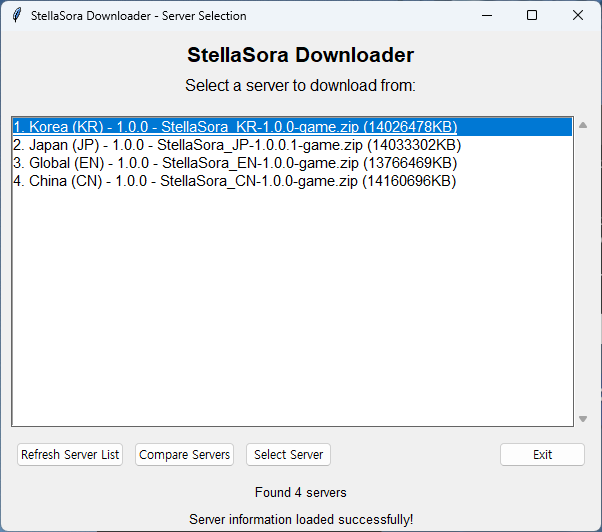
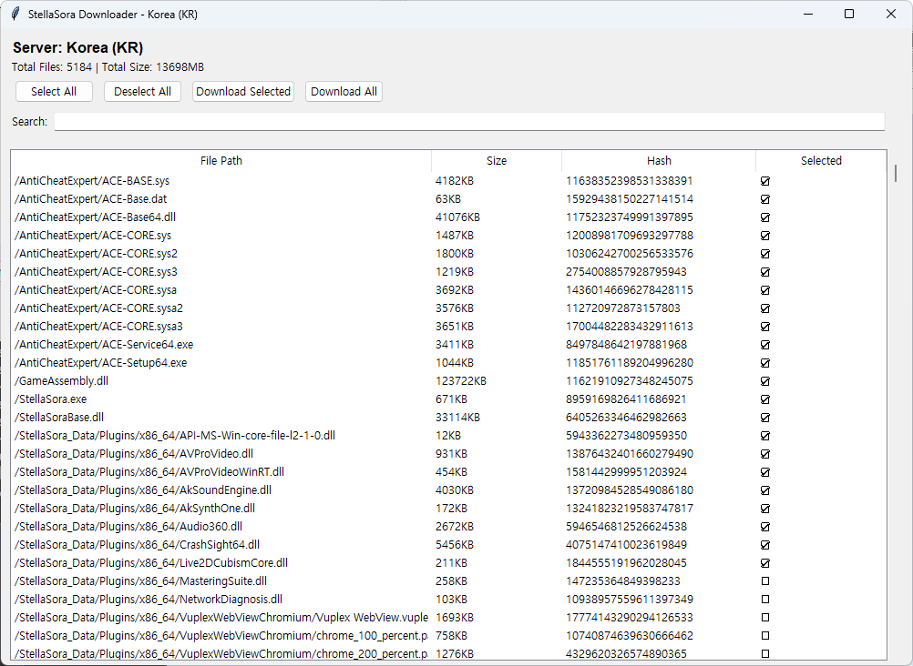
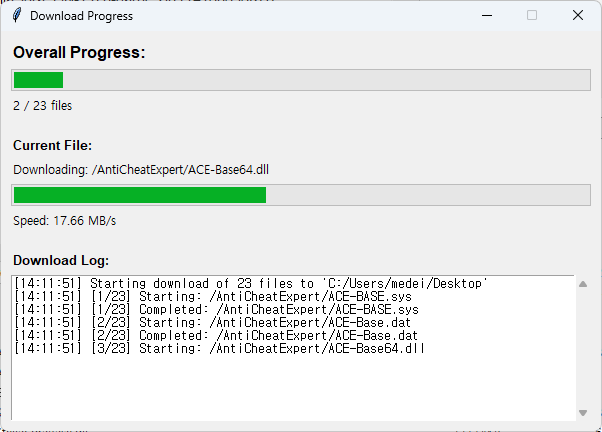
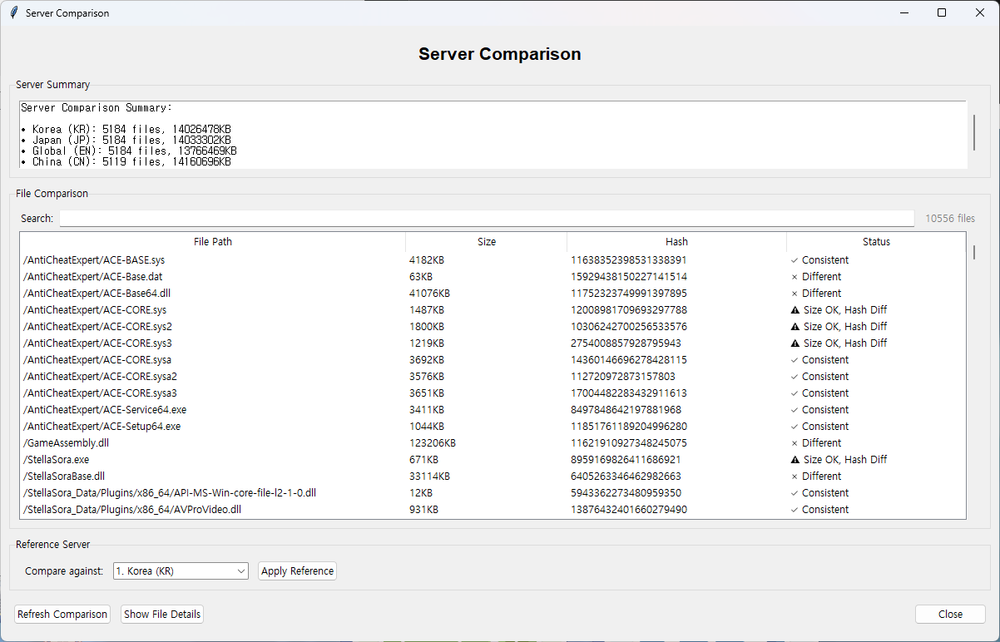

# 星塔旅人 下载器

一个功能全面的GUI应用程序，用于从多个服务器下载星塔旅人游戏文件，具有高级比较和选择功能。

## 功能特点

### 🌐 多服务器支持
- 支持多个星塔旅人服务器（KR、EN、JP、CN）
- 实时服务器状态检查
- 服务器特定文件大小和哈希比较

### 📁 高级文件管理
- **文件选择**：使用复选框选择特定文件进行下载
- **搜索功能**：文件列表的实时搜索
- **拖拽选择**：通过拖拽选择多个文件
- **批量操作**：全选/取消全选功能

### 🔍 服务器比较
- **跨服务器分析**：比较不同服务器之间的文件
- **哈希验证**：使用MD5哈希检查文件完整性
- **大小比较**：识别服务器之间的大小差异
- **参考服务器**：设置参考服务器进行比较
- **详细文件信息**：查看服务器特定文件详情

### 📊 下载管理
- **进度跟踪**：带速度指示器的实时下载进度
- **并发下载**：并行文件下载以加快完成速度
- **错误处理**：带详细日志的强大错误处理
- **恢复功能**：继续中断的下载

### 💾 数据持久化
- **请求日志**：按日期和大小保存服务器请求
- **配置存储**：存储服务器配置以供将来使用
- **清单缓存**：缓存文件清单以加快加载速度

## 截图

### 服务器选择窗口

- 从可用的星塔旅人服务器中选择
- 查看服务器状态和文件数量
- 刷新服务器信息

### 文件下载选择

- 浏览并选择要下载的文件
- 使用搜索查找特定文件
- 拖拽选择多个文件
- 查看文件大小和哈希值

### 下载进度

- 实时监控下载进度
- 查看当前正在下载的文件
- 跟踪下载速度和完成状态

### 服务器比较

- 比较不同服务器之间的文件
- 设置参考服务器进行比较
- 查看一致性状态和差异

## 安装

### 先决条件
- Python 3.7或更高版本
- tkinter（通常随Python一起包含）
- 必需的Python包（参见requirements.txt）

### 设置
1. 克隆存储库：
```bash
git clone https://github.com/yourusername/StellaSoraDownloader.git
cd StellaSoraDownloader
```

2. 安装必需的包：
```bash
pip install -r requirements.txt
```

3. 运行应用程序：
```bash
python main.py
```

## 使用方法

### 基本工作流程
1. **启动应用程序**：运行`python main.py`
2. **选择服务器**：从服务器选择窗口中选择服务器
3. **选择文件**：使用复选框或拖拽选择选择要下载的文件
4. **开始下载**：点击"Download Selected"或"Download All"
5. **监控进度**：在进度窗口中观看下载进度

### 高级功能

#### 服务器比较
1. 在服务器选择窗口中点击"Compare Servers"
2. 使用搜索框过滤文件
3. 使用下拉菜单设置参考服务器
4. 点击"Apply Reference"与所选服务器进行比较
5. 双击文件查看详细的服务器特定信息

#### 文件搜索
- 使用任何文件列表中的搜索框过滤文件
- 搜索不区分大小写，匹配部分文件路径
- 搜索结果显示过滤计数与总计数

#### 拖拽选择
- 点击并拖拽选择多个文件
- 从已选中的文件开始将取消选中范围内的所有文件
- 从未选中的文件开始将选中范围内的所有文件

## 配置

### 服务器设置
应用程序支持在`SERVERS`字典中定义的多个服务器：
- **KR服务器**：韩语星塔旅人服务器
- **EN服务器**：英语星塔旅人服务器
- **JP服务器**：日语星塔旅人服务器
- **CN服务器**：中文星塔旅人服务器

### 文件存储
- 下载的文件保存到所选目录
- 服务器请求数据按日期和服务器自动保存
- 配置文件被缓存以加快后续加载

## 技术细节

### 架构
- **GUI框架**：带ttk（主题化Tkinter）的tkinter
- **线程**：用于服务器请求和下载的后台线程
- **HTTP客户端**：用于API通信的requests库
- **进度跟踪**：用于下载进度条的tqdm

### 文件结构
```
StellaSoraDownloader/
├── main.py                 # 主应用程序文件
├── README.md              # 此文件
├── requirements.txt       # Python依赖项
└── [服务器文件夹]/        # 自动生成的服务器数据文件夹
    └── [大小文件夹]/      # 按文件大小组织的文件夹
        ├── config_*.json
        ├── config2_*.json
        └── manifest_*.json
```

### API集成
- **身份验证**：带服务器特定盐的自定义授权头
- **配置API**：获取游戏配置和版本信息
- **清单API**：下载带哈希和大小信息的文件清单
- **文件下载**：从服务器CDN直接下载文件

## 错误处理

应用程序包含全面的错误处理：
- **网络错误**：带超时处理的自动重试
- **文件错误**：文件系统错误的优雅处理
- **用户中断**：Ctrl+C中断的干净处理
- **无效数据**：服务器响应和文件数据的验证

## 贡献

1. Fork存储库
2. 创建功能分支（`git checkout -b feature/amazing-feature`）
3. 提交更改（`git commit -m 'Add some amazing feature'`）
4. 推送到分支（`git push origin feature/amazing-feature`）
5. 打开Pull Request

## 许可证

此项目在MIT许可证下获得许可 - 有关详细信息，请参阅LICENSE文件。

## 支持

支持和问题：
- 在GitHub上创建问题
- 查看文档
- 查看代码注释以了解实现细节
